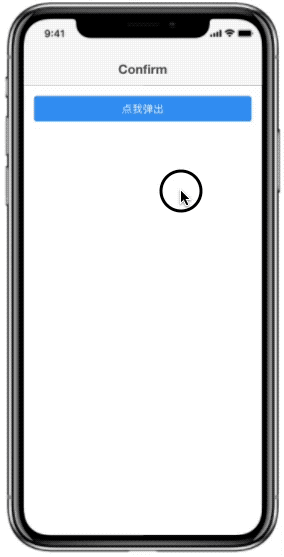
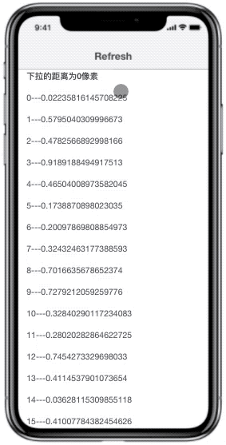
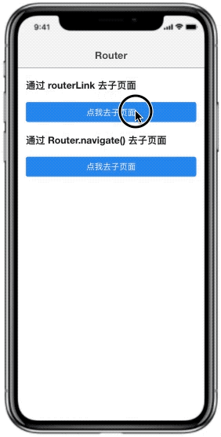
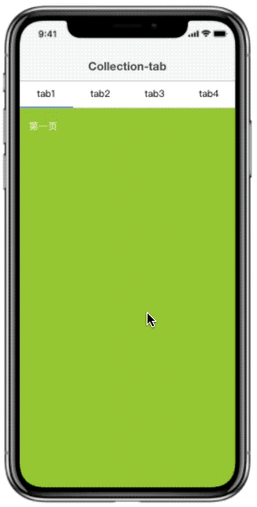

# 简介

`tanbo-ui-native` 是基于 angular 二次开发的移动端开发框架，支持常见的如路由转场动画、触摸手势、上拉加载、下拉刷新等功能。文档地址：[http://www.tanboui.com/native](http://www.tanboui.com/native)。

## example






### 安装

```bash
npm install tanbo-ui-native --save
```

